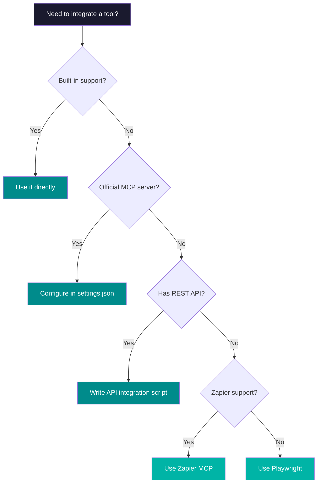

# 7.5 The Complete Third-Party Integration Map

## Claude Code Integration Ranking by Depth

Different third-party tools vary significantly in how deeply they integrate with Claude Code. Listed below from deepest to lightest:

### Tier 1 — Deep Integration (Used Almost Every Time)

| Tool | Depth | Description |
|------|-------|-------------|
| **Git** | ★★★★★ | Built-in support, version control is part of nearly every task |
| **GitHub** | ★★★★★ | Full `gh` CLI support — PRs, Issues, Actions, Reviews |
| **npm / pip** | ★★★★★ | Package management is a core part of daily development |
| **Terminal** | ★★★★★ | The runtime environment for Claude Code itself |

### Tier 2 — Tight Integration (Used Frequently)

| Tool | Depth | Description |
|------|-------|-------------|
| **VS Code / JetBrains** | ★★★★☆ | Official IDE extensions with embedded Claude Code |
| **AWS CLI** | ★★★★☆ | Deployment, database, and server management |
| **Docker** | ★★★★☆ | Containerized deployment and development environments |
| **Google Sheets** | ★★★☆☆ | Via `gspread` + service account |
| **Gmail API** | ★★★☆☆ | Automated email notifications and reports |

### Tier 3 — Moderate Integration (Used as Needed)

| Tool | Depth | Description |
|------|-------|-------------|
| **Slack** | ★★★☆☆ | Webhook or API — notifications and collaboration |
| **Notion** | ★★★☆☆ | API integration — knowledge base and project management |
| **Playwright** | ★★★☆☆ | Browser automation and web scraping |
| **Firebase** | ★★☆☆☆ | FCM push notifications |
| **PostgreSQL** | ★★★☆☆ | Database operations and migrations |

### Tier 4 — Light Integration (Via MCP or API)

| Tool | Depth | Description |
|------|-------|-------------|
| **Figma** | ★★☆☆☆ | Read designs via MCP connector |
| **Jira** | ★★☆☆☆ | API integration — issue tracking |
| **Zapier** | ★★☆☆☆ | Connect 8,000+ apps via MCP |
| **Apify** | ★★☆☆☆ | Web scraping via MCP |

## Decision Tree for Choosing an Integration Method



## MCP Integration Configuration Example

Configure in `~/.claude/settings.json`:

```json
{
  "mcpServers": {
    "github": {
      "command": "gh",
      "args": ["mcp"]
    },
    "slack": {
      "command": "npx",
      "args": ["-y", "@anthropic/slack-mcp"],
      "env": {
        "SLACK_TOKEN": "xoxb-..."
      }
    },
    "notion": {
      "command": "npx",
      "args": ["-y", "@anthropic/notion-mcp"],
      "env": {
        "NOTION_TOKEN": "secret_..."
      }
    }
  }
}
```

## Claude Code vs Cowork Integration Comparison

| Scenario | Recommended Tool | Reason |
|----------|-----------------|--------|
| Write code + Git + deploy | Claude Code | Native development environment |
| Organize documents + send emails | Cowork | Connectors are more convenient |
| Automation scripts + cron | Claude Code | Terminal + Task Scheduler |
| Cross-application workflows | Cowork | Plugin + connector |
| Data analysis + reports | Depends on technical ability | Code is more powerful, Cowork is easier |

## Integration Security Guidelines

1. **Never commit API keys to Git** — Use `.env` or environment variables
2. **Principle of least privilege** — Only grant the access that's necessary
3. **Rotate tokens regularly** — Especially for long-running automations
4. **Always review external Skills** — Prompt injection is a real risk
5. **Keep Webhook URLs secret** — A leaked URL means anyone can trigger it

---

## Summary

Mastering third-party integrations is the key to upgrading from "using Claude Code to write code" to "using Claude Code to manage your entire business."

Core principles:
- **GitHub** is infrastructure — use it on every project
- **Google ecosystem** is your data hub — Sheets + Gmail covers most needs
- **Slack/Notion** is the collaboration hub — team communication and knowledge management
- **AWS** is your deployment target — push results to production
- **MCP** is the universal glue — connects everything

---

<div class="module-quiz">
<h3>Module Quiz</h3>

<div class="quiz-q" data-answer="1">
<p>1. According to the integration depth ranking, which tools are Tier 1 (deepest integration, used almost every time)?</p>
<label><input type="radio" name="q1" value="0"> Slack, Notion, and Firebase</label>
<label><input type="radio" name="q1" value="1"> Git, GitHub, npm/pip, and the Terminal</label>
<label><input type="radio" name="q1" value="2"> AWS CLI, Docker, and Google Sheets</label>
<label><input type="radio" name="q1" value="3"> Figma, Jira, and Zapier</label>
<div class="quiz-explain">Tier 1 tools are Git, GitHub, npm/pip, and the Terminal -- they have the deepest integration and are used in almost every Claude Code session. They are built-in and form the core development workflow.</div>
</div>

<div class="quiz-q" data-answer="2">
<p>2. When you need to integrate a third-party tool, what is the first question in the decision tree?</p>
<label><input type="radio" name="q2" value="0"> Is there a Zapier connector available?</label>
<label><input type="radio" name="q2" value="1"> Can you use Playwright for browser automation?</label>
<label><input type="radio" name="q2" value="2"> Does Claude Code have built-in support for it?</label>
<label><input type="radio" name="q2" value="3"> Does it have a REST API?</label>
<div class="quiz-explain">The decision tree starts with checking if Claude Code has built-in support (like Git, npm, CLI tools). If yes, use it directly. If not, check for an MCP server, then REST API, then Zapier, and finally Playwright as a last resort.</div>
</div>

<div class="quiz-q" data-answer="0">
<p>3. Which is the most important security guideline for third-party integrations?</p>
<label><input type="radio" name="q3" value="0"> Never commit API keys to Git -- use .env or environment variables</label>
<label><input type="radio" name="q3" value="1"> Always use the latest version of every integration</label>
<label><input type="radio" name="q3" value="2"> Only integrate tools from the official Anthropic marketplace</label>
<label><input type="radio" name="q3" value="3"> Always use Cowork instead of Claude Code for integrations</label>
<div class="quiz-explain">The top security guideline is to never commit API keys to Git. Use .env files or environment variables instead. Other important practices include following least privilege, rotating tokens regularly, and reviewing external Skills for prompt injection.</div>
</div>

<button class="quiz-submit">Submit Answers</button>
<div class="quiz-result"></div>
</div>

## Exercises

1. Draw your own "third-party integration map" -- list the tools you use daily and label how they integrate
2. Pick a Tier 3/4 tool and try integrating it via MCP or API
3. Design an automation workflow that spans 3 different tools
